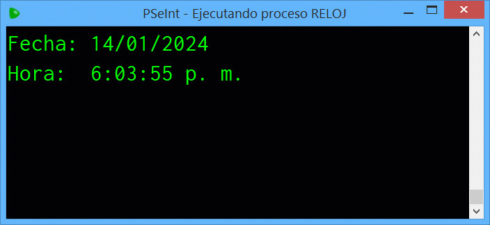

# Reloj

Desarrollar un algoritmo en pseudocódigo que simule un calendario y reloj. El programa deberá mostrar la fecha y 
hora actual, actualizándose en tiempo real cada segundo, siguiendo el formato especificado a continuación:
- Fecha: día / mes / año
- Hora: hora : minutos : segundos a.m./p.m. (en el sistema horario de 12 horas).

---

> **Ejemplo**

  

---
